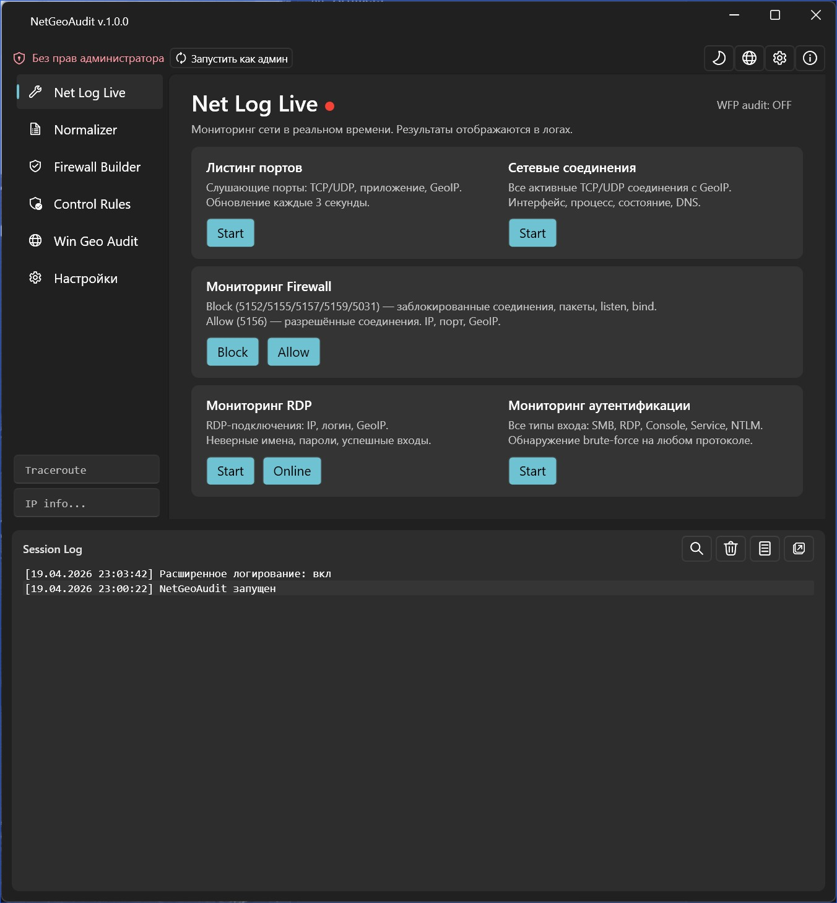
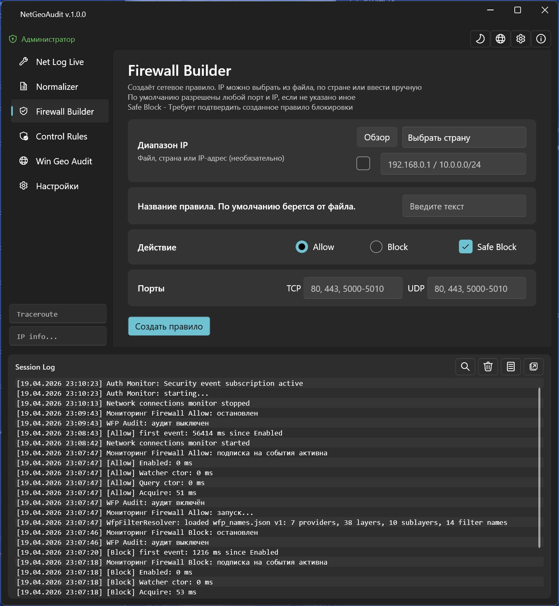
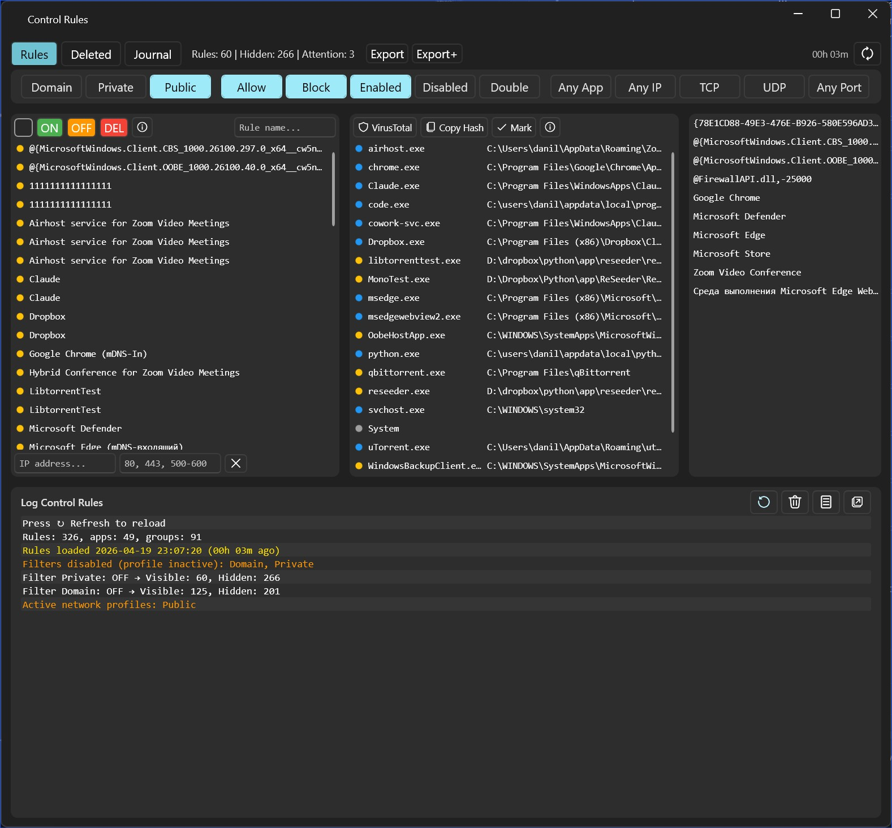
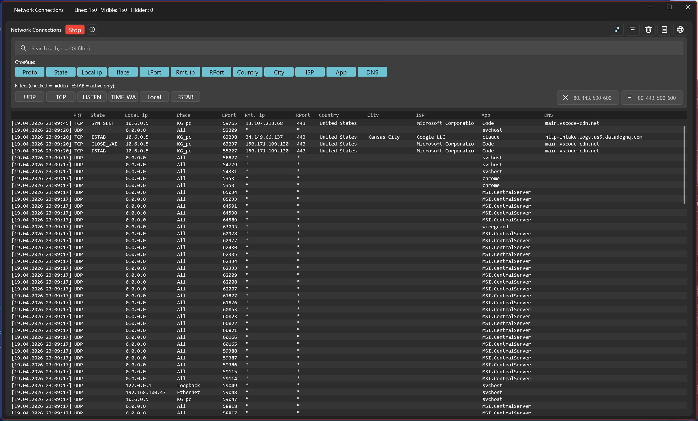

# NetGeoAudit

### Live-мониторинг firewall и геоаудит безопасности для Windows

**Одно окно для всего, что происходит с вашей сетью — заблокированные и разрешённые соединения, правила firewall, GeoIP и глубокий гео-аудит системы. Локальные базы, без телеметрии.**

-orange)

[🌍 English version](README.md) · **🇷🇺 Русская версия**

---

> ⬇️ **NetGeoAudit — продукт с закрытым исходным кодом.** Этот репозиторий — домашняя страница и документация проекта.
> **Скачать (бесплатную и платную версии) можно только с официального сайта → [www.netgeoaudit.com](https://www.netgeoaudit.com/)**

---

## Что такое NetGeoAudit?

**NetGeoAudit** — портативная десктоп-утилита для Windows, объединяющая **мониторинг firewall**, **управление правилами брандмауэра Windows**, **логирование сетевых соединений** и **геоаудит IP** в одном приложении с интерфейсом в стиле Fluent.

Она показывает, что ваша машина на самом деле делает в сети — в реальном времени, на уровне **firewall / WFP** (а не перехвата пакетов) — привязывает каждое соединение к **процессу**, обогащает его **офлайн-GeoIP** (страна, город, ASN, ISP) и позволяет **аудировать, создавать и контролировать** правила брандмауэра Windows. Плюс глубокий **гео-аудит системы**: 50+ сканеров, определяющих, какой стране *на самом деле* принадлежит машина.

> **Принцип «локально и тихо».** Все базы геолокации входят в комплект и работают **офлайн**. **Телеметрии нет.** Приложение выходит в сеть только для проверки лицензии и (опционально) для определения публичного IP.

---

## ✨ Возможности

### 🛰️ Net Log Live — сетевой монитор в реальном времени
Живые мониторы на базе **Windows Event Log** и **Windows Filtering Platform (WFP)**, а также захват через **ядро ETW**:
- **Заблокированные** и **разрешённые** соединения в момент возникновения
- События **RDP-сессий** и **аутентификации / входа в систему**
- **IPv4 и IPv6** с **привязкой к процессу** (какая программа открыла соединение)
- **GeoIP-обогащение** каждой строки (страна / город / ASN)
- Умная **дедупликация по временно́му окну** с бейджем повторов `×N` — шумные события сворачиваются в одну строку

### 🧱 Firewall Builder — блокировка по стране, диапазону или списку
Создание правил **брандмауэра Windows** из:
- **диапазонов IP** и блоков **CIDR**
- **файлов со списком IP** (вставка или импорт)
- **выбора страны** (блокировка целых стран по GeoIP)

Есть шаг подтверждения **«Безопасная блокировка»** и **автоматическое разбиение на части** для обхода ограничений COM API брандмауэра на больших наборах правил.

### 🛡️ Control Rules — аудит вашего firewall
Полный аудит существующих правил брандмауэра Windows:
- **5-уровневая шкала рисков** для каждого правила
- **Группировка по приложениям**
- **13 toggle-фильтров** для среза набора правил
- Интеграция с **VirusTotal** (проверка SHA-256) и локальная проверка подписи **Authenticode**
- Безопасные **удаление и отмена** с журналом действий

### 🌐 Win Geo Audit — какой стране реально принадлежит машина?
**50+ системных сканеров**: локаль, реестр, WMI, сертификаты, **Telephony API / SIM MCC**, настройки Wi-Fi, часовой пояс, публичный IP и многое другое — объединённые в **18-уровневую цепочку определения страны** с перекрёстной проверкой сигналов.

### 🗺️ Traceroute + GeoIP
- **Геолокация каждого хопа** трассировки по **офлайн-базам MaxMind GeoLite2**
- Отдельный **поиск по IP**: континент, страна, город, **ASN**, **ISP**

### 🧮 Normalizer — приведение списков IP в порядок
Парсинг и нормализация файлов с IP: **CIDR**, диапазоны и одиночные адреса, со **слиянием пересечений** и разбиением по количеству строк.

---

## 📸 Скриншоты

| Net Log Live | Firewall Builder |
|---|---|
|  |  |

| Аудит Control Rules | Соединения + GeoIP |
|---|---|
|  |  |

---

## 💻 Системные требования

| | |
|---|---|
| **ОС** | Windows 10 / 11 (Windows Server 2019/2022 — частичная поддержка) |
| **Среда** | .NET 10 |
| **Права** | Администратор — для мониторинга WFP, доступа к Event Log и управления правилами; часть функций работает без повышения прав |
| **Формат** | Портативный — без установщика, с самообновлением |

---

## 💸 Цена и версии

| | Бесплатная версия | Полная лицензия |
|---|---|---|
| **Цена** | Бесплатно, **бессрочно** | **5000 ₽** разово, бессрочно |
| **Объём** | С ограничениями | Всё разблокировано |
| **Привязка** | — | Одна машина на ключ (скидки от 5+ лицензий) |
| **Обновления** | — | Все обновления **v1.x** включены |
| **Коммерческое использование** | — | Разрешено по лицензии |

👉 **Скачать на [www.netgeoaudit.com](https://www.netgeoaudit.com/)**

---

## 🔒 Приватность

- Все базы геолокации (**MaxMind GeoLite2 City + ASN**) встроены и работают **полностью офлайн**
- **Никакой телеметрии**, аналитики и внешних API для основных функций
- Сеть используется только для **проверки лицензии** и **опционального** определения публичного IP

---

## ❓ Частые вопросы

**Зачем нужны права администратора?**
Мониторинг WFP, доступ к Windows Event Log и управление правилами firewall требуют повышения прав. Утилитарные функции «только чтение» работают и без них.

**Чем отличается от Wireshark?**
Wireshark декодирует пакеты на уровне протоколов. NetGeoAudit работает на уровне **firewall / WFP и Event Log** — показывает, какое **правило** сработало и какая **программа** владеет соединением, с обогащением GeoIP — без перехвата пакетов.

**Приложение «звонит домой»?**
Телеметрии нет. Базы офлайн. Сеть нужна только для проверки лицензии и опционального определения публичного IP.

**Есть ли исходный код?**
Нет — NetGeoAudit это проприетарный продукт с закрытым кодом. В этом репозитории — документация и ссылки; скачивание на [официальном сайте](https://www.netgeoaudit.com/).

---

## 🧩 Технологии

`.NET 10` · `C#` · `WPF` + `WPF-UI 4.x` (Fluent Design) · `CommunityToolkit.Mvvm` (MVVM) · `SQLite` · `MaxMind GeoLite2` (офлайн GeoIP) · `ETW / TraceEvent` · `Windows Filtering Platform (WFP)`

---

## 🔎 Ключевые слова

мониторинг брандмауэра Windows · мониторинг WFP · Windows Filtering Platform · логирование сетевых соединений · firewall log в реальном времени · блокировка IP по стране · конструктор правил firewall · аудит правил брандмауэра Windows · оценка риска правил · поиск GeoIP · геолокация IP · MaxMind GeoLite2 офлайн · геолокация traceroute · поиск ASN / ISP · альтернатива netstat · мониторинг входов RDP · журнал событий аутентификации · захват сети ETW · проверка хеша VirusTotal · проверка Authenticode · threat hunting · аудит сетевой безопасности · гео-аудит системы · определение страны · портативная утилита безопасности Windows · без телеметрии · IPv4 IPv6 · нормализатор CIDR

---

**[⬇️ Скачать NetGeoAudit](https://www.netgeoaudit.com/)** · **[🌐 Официальный сайт](https://www.netgeoaudit.com/)** · **[🌍 English description](README.md)**

© NetGeoAudit / byFox. Windows — товарный знак Microsoft. MaxMind и GeoLite2 — товарные знаки MaxMind, Inc.

